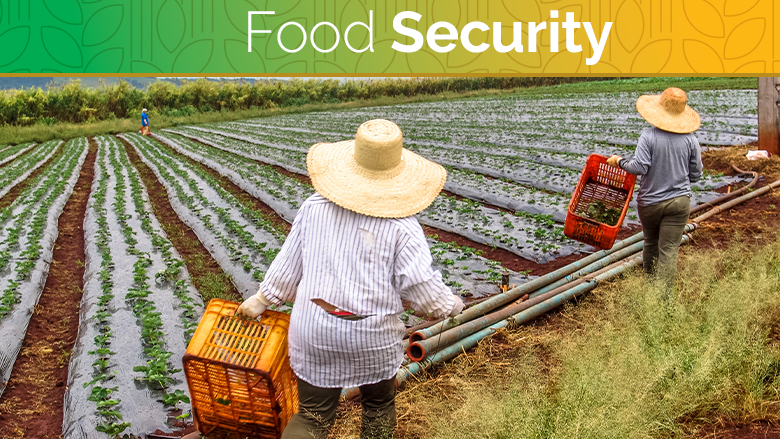

# Machine-Learning-Project
# PROJECT OVERVIEW
# Food Security Status Prediction

This Project aims to develop a machine learning model that predicts food Security Status among households living in two urban informal settlements of Nairobi, Kenya.
# Dataset
I used a Food Security Dataset that was collected to conduct a study and understand households living in two urban informal settlements of Nairobi, their food security status and related determinants in 2014. The dataset includes the variables listed below:

* ID	- Identification number of the household,
* site	-      Site of the study,
* hhedu	- Household head level of education,
* hhage	-    Household head age,
* hhhsex	-  Sex of household head,
* hhethnic-	  Ethnicity of household head,
* hhsize-	    Size of household,
* u05 -	      Number of people aged under-5,
* povline	-   Whether a household is below the poverty line, yes or no,
* windex3 -	  Wealth tertile of household,
* windex5 -	  Wealth quintile of household,
* FS_score -	Food security score (continuous),
* FS	-       Food security status
# Methodology
I used a Random Forest Classifier to predict food security status. I tuned hyperparameters using GridSearchCV
# Results
My model achieved an accuracy score of 51% on the test set. I also interestingly discovered that High Education level does not predict access to quality and healthy food.
Households with primary and Secondary Level education had high food security.
# Usage
To use this project you will need to install the following dependencies:
'Python 3', pandas, sklearn, numpy, seaborn, matplotlib. Also
to make everything easier, download and install Anaconda from the official Anaconda website.
open Jupyter notebook
# Contributing
I welcome contributions to this project! if you would like to submit an issue or pull request, please follow these guidelines:
* Submit issue using github issue tracker
* Submit pull request with a clear description of the changes
# Limitation
* The dataset used is limited to a specific region and may not be generalizable to other areas
*  The model relies on a limited set of features and may not capture all relevant factor influencing food security.

#

